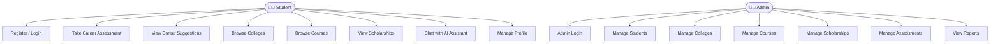

# User Use Case Diagram

```mermaid
flowchart TD

Student([👨‍🎓 Student])
Admin([👨‍💼 Admin])

Student --> Login[Register / Login]
Student --> Assessment[Take Career Assessment]
Student --> Career[View Career Suggestions]
Student --> Colleges[Browse Colleges]
Student --> Courses[Browse Courses]
Student --> Scholarships[View Scholarships]
Student --> Chat[Chat with AI Assistant]
Student --> Profile[Manage Profile]

Admin --> AdminLogin[Admin Login]
Admin --> ManageStudents[Manage Students]
Admin --> ManageColleges[Manage Colleges]
Admin --> ManageCourses[Manage Courses]
Admin --> ManageScholarships[Manage Scholarships]
Admin --> ManageAssessment[Manage Assessments]
Admin --> Reports[View Reports]
```
